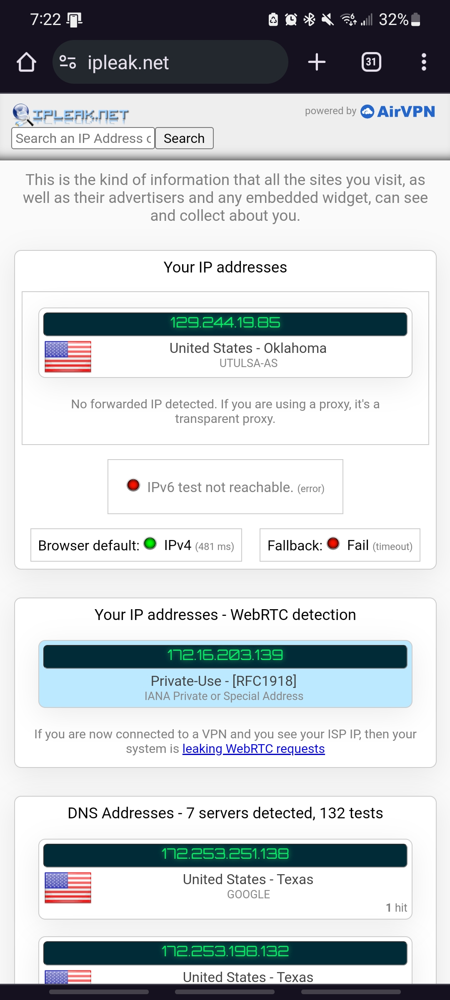
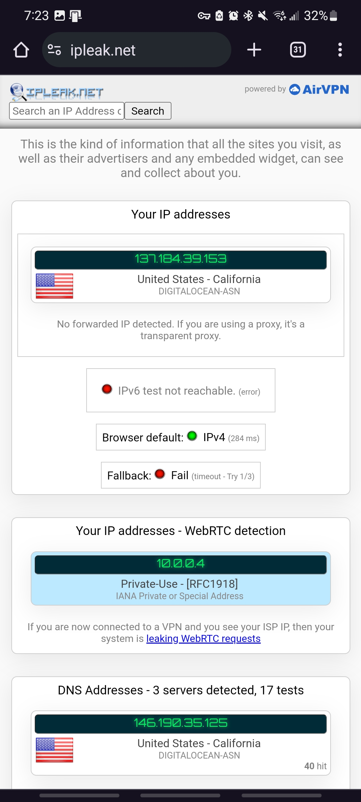

# Lab 3 - WireGuard
### _Report by Noah Ralston_

This report is designed to give step-by-step instructions on how to install WireGuard using DigitalOcean

## Step 1: DigitalOcean Account
To keep in line with the instructions given in class, this step is being included for redundancy

1. Go to digitalocean.com and create a new account

Note: Be sure to use the link for $200 credit

## Step 2: Creating a Droplet
We need a droplet to hold our VPN, so let's make one
1. Go to the control panel and select "Droplets" on the right of the screen
2. Select "Create Droplet"
3. Pick the datacenter that works best for you (or let DO select it for you)
4. Change the Ubuntu version to 20.04
5. Choose the regular CPU
6. Select your desired monthly plan (I went with $6/month just to be safe)
7. Choose an authentication method (I went with a password)
8. Create your droplet

## Step 3: Install Docker and Docker Compose
We are going to install docker so that the WireGuard is much easier later
1. Launch your droplet console by selecting "Access Console" under the three dots on your droplet, then click "Launch Droplet Console"
2. Install Ubuntu Linux on a VM or onto specific hardware (skipping most of these steps because it is very simple)
3. Navigate to the terminal and use these commands
```sh
sudo apt update
sudo apt install docker.io
```
4. Start the docker daemon by running the command
```sh
sudo systemctl start docker
```
5. Set up the apt repository
```sh
sudo apt-get update
sudo apt-get install ca-certificates curl gnupg
sudo install -m 0755 -d /etc/apt/keyrings
curl -fsSL https://download.docker.com/linux/ubuntu/gpg | sudo gpg --dearmor -o /etc/apt/keyrings/docker.gpg
sudo chmod a+r /etc/apt/keyrings/docker.gpg

echo \
  "deb [arch=$(dpkg --print-architecture) signed-by=/etc/apt/keyrings/docker.gpg] https://download.docker.com/linux/ubuntu \
  $(. /etc/os-release && echo "$VERSION_CODENAME") stable" | \
  sudo tee /etc/apt/sources.list.d/docker.list > /dev/null
sudo apt-get update
```

6. Check to make sure that docker works by running:
```sh
sudo docker run hello-world
```

7. Install the docker compose plugin by running
```sh
sudo apt-get install docker-compose-plugin
```

8. Ensure that Docker compose was downloaded correctly by running
```sh
docker compose version
```

## Step 4: Install Wireguard
Now that we have Docker and Docker Compose properly set up, we can now download WireGuard
1. Run these commands on the droplet:
```sh
mkdir -p ~/wireguard/
mkdir -p ~/wireguard/config/
nano ~/wireguard/docker-compose.yml
```
2. Edit the docker compose file with this text:
```sh
version: '3.8'
services:
  wireguard:
    container_name: wireguard
    image: linuxserver/wireguard
    environment:
      - PUID=1000
      - PGID=1000
      - TZ=[your timezone]
      - SERVERURL=[your droplet ip address]
      - SERVERPORT=51820
      - PEERS=pc1,pc2,phone1
      - PEERDNS=auto
      - INTERNAL_SUBNET=10.0.0.0
    ports:
      - 51820:51820/udp
    volumes:
      - type: bind
        source: ./config/
        target: /config/
      - type: bind
        source: /lib/modules
        target: /lib/modules
    restart: always
    cap_add:
      - NET_ADMIN
      - SYS_MODULE
    sysctls:
      - net.ipv4.conf.all.src_valid_mark=1
```
and save the file with ctrl x, y, and ENTER

3. Start Wireguard by running these commands:
```sh
cd ~/wireguard/
docker-compose up -d
```
4. Connect your phone to Wireguard by running this command:
```sh
docker-compose logs -f wireguard
```
5. Download Wireguard on your phone and on  your laptop
6. Connect to the VPN using the QR code on the droplet
7. Find the conf file by cd-ing into the user you want to attach your laptop to
8. Nano the conf file and copy the text
9. Insert into a txt file and save as a conf file
10. Load this into Wireguard on the PC and click activate

And there you go! Wireguard is activated on both your phone and computer!

Below you will find the screenshots of the required work

Before using the tunnel on mobile

After using the tunnel on mobile

Before using the tunnel on PC

After using the tunnel on PC
