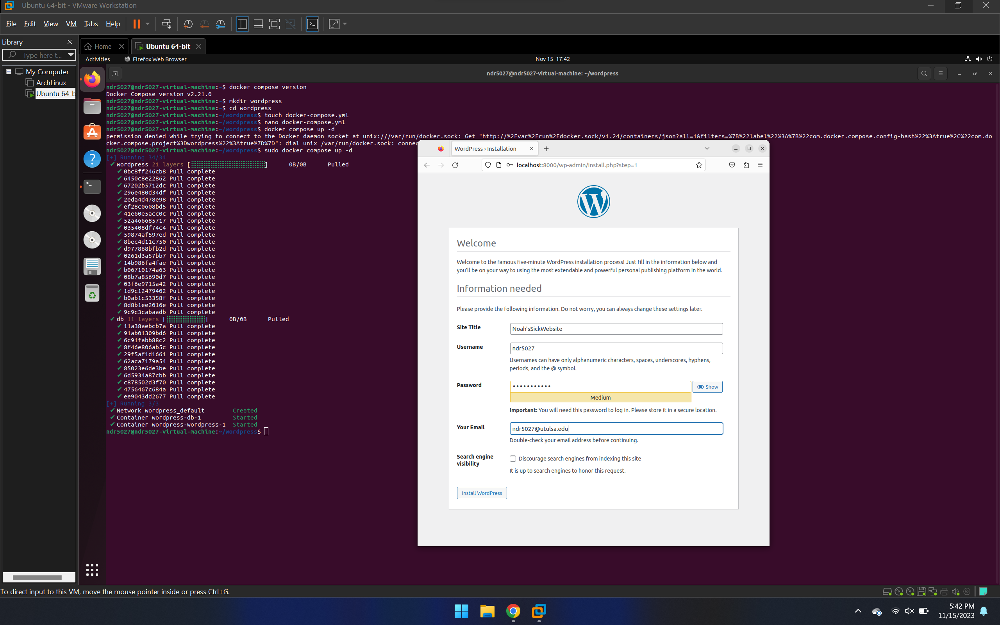
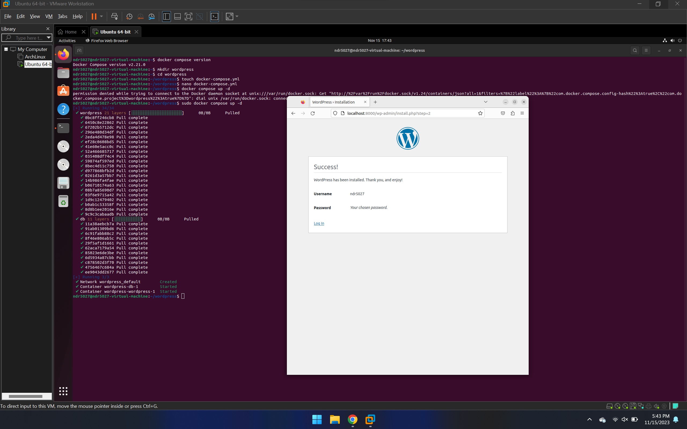

# WordPress Install
### _Report by Noah Ralston_

This report is designed to show how I installed OpenVAS onto a Ubuntu based system.

## Step 0: Docker
Though this is not a required portion of this report, I believe understanding how to install docker could be beneficial to me in the future, so I'm putting it here anyways

1. Install Ubuntu Linux on a VM or onto specific hardware (skipping most of these steps because it is very simple)
2. Navigate to the terminal and use these commands
```sh
sudo apt update
sudo apt install docker.io
```
3. Start the docker daemon by running the command
```sh
sudo systemctl start docker
```
4. Install the docker compose plugin by running
```sh
sudo apt install docker-compose-plugin
```
5. Test by finding the compose version
```sh
docker compose version
```
6. Add yourself to the docker group
```sh
sudo usermod -aG docker $USER && su $USER
```
7. Check to make sure that docker works by running:
```sh
sudo docker run hello-world
```
Now you have installed docker and are ready to install WordPress

## Step 1: Install WordPress
Now that we have most of the heavy lifting out of the way, we can install WordPress using some commands and some time
1. Create a directory for WordPress:
```sh
mkdir wordpress
```
2. Change directory into the new wordpress directory:
```sh
cd wordpress
```
3. Create a yml file
```sh
touch docker-compose.yml
```
4. Nano into the file
```sh
nano docker-compose.yml
```
5. Paset in the yml file:
```sh
version: "3" 
# Defines which compose version to use
services:
  # Services line define which Docker images to run. In this case, it will be MySQL server and WordPress image.
  db:
    image: mysql:5.7
    # image: mysql:5.7 indicates the MySQL database container image from Docker Hub used in this installation.
    restart: always
    environment:
      MYSQL_ROOT_PASSWORD: MyR00tMySQLPa$$5w0rD
      MYSQL_DATABASE: MyWordPressDatabaseName
      MYSQL_USER: MyWordPressUser
      MYSQL_PASSWORD: Pa$$5w0rD
      # Previous four lines define the main variables needed for the MySQL container to work: database, database username, database user password, and the MySQL root password.
  wordpress:
    depends_on:
      - db
    image: wordpress:latest
    restart: always
    # Restart line controls the restart mode, meaning if the container stops running for any reason, it will restart the process immediately.
    ports:
      - "8000:80"
      # The previous line defines the port that the WordPress container will use. After successful installation, the full path will look like this: http://localhost:8000
    environment:
      WORDPRESS_DB_HOST: db:3306
      WORDPRESS_DB_USER: MyWordPressUser
      WORDPRESS_DB_PASSWORD: Pa$$5w0rD
      WORDPRESS_DB_NAME: MyWordPressDatabaseName
# Similar to MySQL image variables, the last four lines define the main variables needed for the WordPress container to work properly with the MySQL container.
    volumes:
      ["./:/var/www/html"]
volumes:
  mysql: {}
```

## Step 3: Finishing up
All that is left to do is finish the installation on the internet
1. Open up a browser and go to http://localhost:8000/
2. Complete the account creation, and finish the install

And there you go! WordPress has now been installed! Below you will find some photos of what it looks like at the end of the process:



